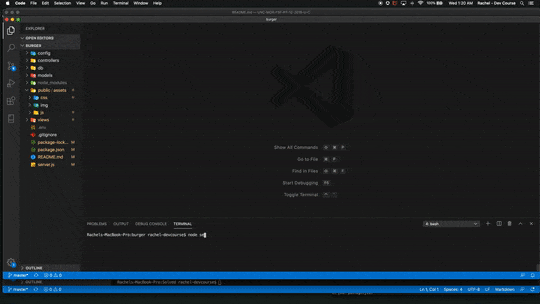

# Burger!
A Node/Express/Handlebars burger logger app made with Mysql for hw 13
View live Heroku deployment <a href="https://rhumble-burger.herokuapp.com/">HERE</a>

```
As a burger-phile
I want to be able to add and manage the different burgers I've both tried and want to try
So that I can organize and plan future burger adventures
```


## Installation: 
1- Clone repo 2- Install required dependencies ("npm i")

## Usage: 
Open in console, run start file ("node server.js") > open http://localhost:9000 in browser

### License: 
N/A

### Contributors: 
Rachel Humble

### Tests: 
N/A

**Created by: rachelhumble@me.com** 
    

&copy; 2020 Rachel Humble 
